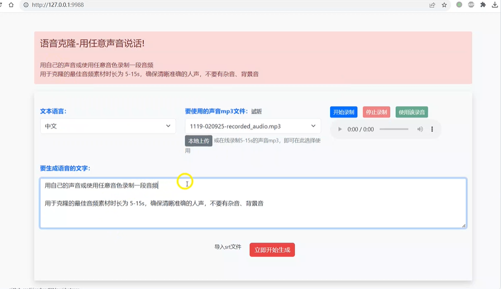
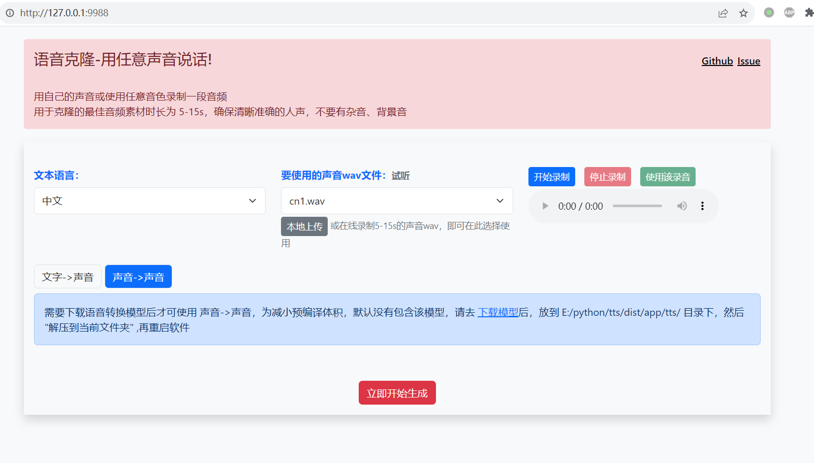

# CV声音克隆工具

> 
> 这是一个声音克隆工具，可使用任何人类音色，将一段文字合成为使用该音色说话的声音，或者将一个声音使用该音色转换为另一个声音。
> 
> 使用非常简单，没有N卡GPU也可以使用，下载预编译版本，双击 app.exe 打开一个web界面，鼠标点点就能用。
> 
> 支持 **中文**、**英文**、**日语**、**韩语** 4种语言，可在线从麦克风录制声音。
> 
> 为保证合成效果，建议录制时长5秒到20秒，发音清晰准确，不要存在背景噪声。
> 
> 英文效果很棒，中文效果还凑合。
> 

# 视频演示

https://github.com/jianchang512/clone-voice/assets/3378335/a0b44b50-66b5-47a1-bb13-41f9251ceda8

# 使用方法

1. 右侧[Releases](https://github.com/jianchang512/clone-voice/releases)中下载预编译版，适用于window 10/11(已含文字到语音模型，语音到语音模型需单独下载),Mac下请拉取源码自行编译
2. 下载后解压到某处，比如 E:/clone-voice 下
3. 双击 start.bat ，等待自动打开web窗口，如下

4. 输入文字或者上传想转换的音频文件，然后录制或从本地上传一段音色文件，开始转换
5. 为减小体积，预编译版仅支持CPU，只包含文字到语音模型
	
    如果需要语音到语音功能，即上传一个音频文件，然后将该音频转换为使用选定音色的另一个音频，需单独下载**语音到语音(speech-to-speech)模型**，然后放到和app.exe同级的tts文件夹中，右键“解压到当前文件夹下” 解压后如图
    
    

6. 如需GPU支持，请拉取源码本地编译

# 源码部署/以window为例，其他类似

0. 要求 python 3.9+
1. 创建空目录，比如 E:/clone-voice
2. 创建虚拟环境 `python -m venv venv`
3. 激活环境 `cd venv/scripts`,`activate`,`cd ../..`
4. 安装依赖 CPU版: `pip install -r requirements.txt`, GPU版:`pip install -r requirements-gpu.txt`
5. 解压 ffmpeg.7z 到项目根目录
6. 下载模型 **文字到语音(text-to-speech)模型**  和  **语音到语音(speect-to-speech)模型**  到项目目录下的tts文件中，然后解压到当前文件夹
7. 启动 `python app.py`

# 模型下载

1. 语音到语音模型(speech-to-speech)百度网盘下载
链接：[https://pan.baidu.com/s/1vIYzxnlmx2_4prahufoEEw?pwd=hgh2](https://pan.baidu.com/s/1vIYzxnlmx2_4prahufoEEw?pwd=hgh2)
提取码：hgh2
从github下载: [https://github.com/jianchang512/clone-voice/releases/tag/v0.0.1](https://github.com/jianchang512/clone-voice/releases/tag/v0.0.1)
解压后

2. 文字到语音模型(text-to-speech)百度网盘下载(预编译版已包含该模型)
链接：[https://pan.baidu.com/s/1LA3JFIb0MnCgoF0Q1sW5dQ?pwd=5k7c](https://pan.baidu.com/s/1LA3JFIb0MnCgoF0Q1sW5dQ?pwd=5k7c)
提取码：5k7c
从github下载: [https://github.com/jianchang512/clone-voice/releases/tag/v0.0.1](https://github.com/jianchang512/clone-voice/releases/tag/v0.0.1)
解压后

3. 预编译版下载(已包含text-t-speech文字到语音模型)
点击右侧 Releases,下载最新版本

# 注意事项

1. 启动后需要冷加载模型，会消耗一些时间，请耐心等待显示出`http://127.0.0.1:9988`， 并自动打开浏览器页面后，稍等两三分钟后再进行转换
2. 功能有：

		文字到语音:即输入文字，用选定的音色生成声音，这个功能预编译已包含模型，开箱即用。
		语音到语音：即从本地选择一个音频文件，用选定的音色生成另一个音频文件，为减小预编译版体积，没有包含在内，需要单独下载模型，放在app.exe 同目录下的tts文件夹中，解压到当前文件夹下，解压后会多两个文件夹,`voice_conversion_models--multilingual--vctk--freevc24`和`wavlm`,请确保位置正确
		
3. 如果打开的cmd窗口很久不动，需要在上面按下回车才继续输出，请在cmd左上角图标上单击，选择“属性”，然后取消“快速编辑”和“插入模式”的复选框

# 预览图

# [Youtube演示视频](https://youtu.be/NL5cIoJ9Gjo)
