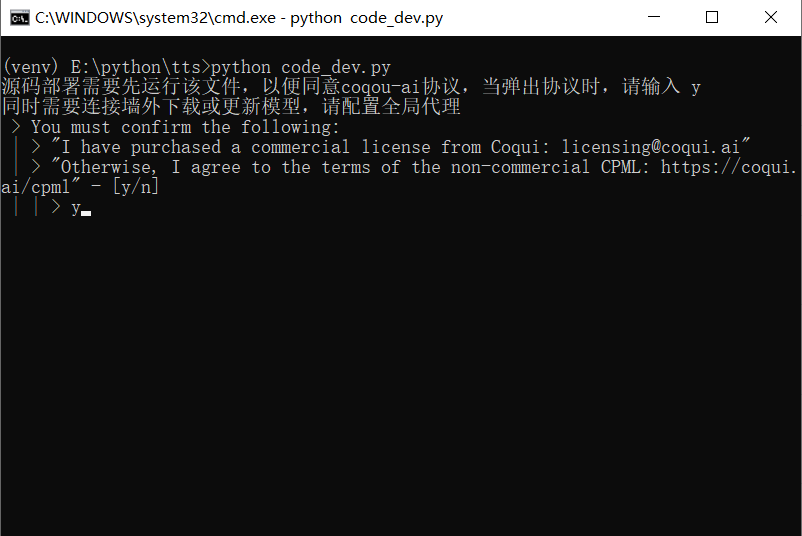
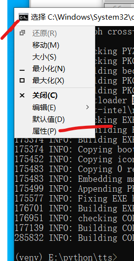
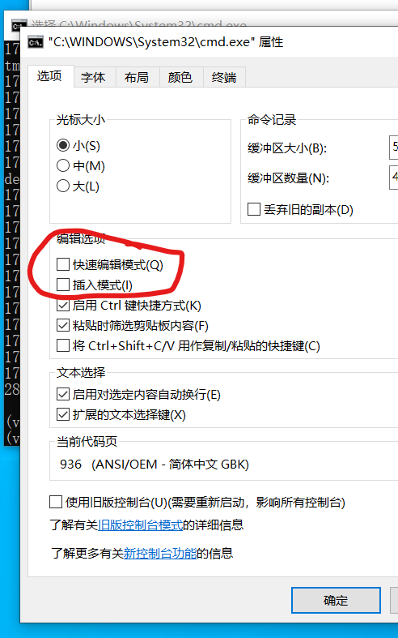

[English Version](./README_EN.md)  / [加入Discord讨论](https://discord.gg/TMCM2PfHzQ) / [捐助项目](https://github.com/jianchang512/clone-voice/issues/10) / QQ群 902124277
# CV声音克隆工具

该项目所用模型均源于 https://github.com/coqui-ai/TTS  ，模型协议为[CPML](https://coqui.ai/cpml/)只可用于学习研究，不可商用


> 
> 这是一个声音克隆工具，可使用任何人类音色，将一段文字合成为使用该音色说话的声音，或者将一个声音使用该音色转换为另一个声音。
> 
> 使用非常简单，没有N卡GPU也可以使用，下载预编译版本，双击 app.exe 打开一个web界面，鼠标点点就能用。
> 
> 支持 **中、英、日、韩、法、德、意等16种语言**，可在线从麦克风录制声音。
> 
> 为保证合成效果，建议录制时长5秒到20秒，发音清晰准确，不要存在背景噪声。
> 
> 英文效果很棒，中文效果还凑合。
> 


# 视频演示


https://github.com/jianchang512/clone-voice/assets/3378335/4e63f2ac-cc68-4324-a4d9-ecf4d4f81acd


# win下预编译版使用方法(其他系统可源码部署)

1. 右侧[Releases](https://github.com/jianchang512/clone-voice/releases)中分别下载 预编译版主文件(1.7G)和  模型(3G)

2. 下载后解压到某处，比如 E:/clone-voice 下

3. 双击 app.exe ，等待自动打开web窗口，**请仔细阅读cmd窗口的文字提示**,如有错误，均会在此显示


4. 模型下载后解压到软件目录下的 `tts` 文件夹内，解压后效果如图 


5. 转换操作步骤
	
	- 在文本框中输入文字、或导入srt文件，或者选择“声音->声音”，选择要转换的声音wav格式文件
	
	- 然后从“要使用的声音wav文件”下拉框中选择要用的声音，如果没有满意的，也可以点击“本地上传”按钮，选择已录制好的5-20s的wav声音文件。或者点击“开始录制”按钮，在线录制你自己的声音5-20s，录制完成点击使用
	
	- 点击“立即开始生成”按钮，耐心等待完成。

6. 如果机器拥有N卡GPU，并正确配置了CUDA环境，将自动使用CUDA加速


# 源码部署(linux mac window)

**源码版需要全局代理，因为要从 https://huggingface.co 下载模型，而这个网址国内无法访问**

0. 要求 python 3.9->3.11
1. 创建空目录，比如 E:/clone-voice, 在这个目录下打开 cmd 窗口，方法是地址栏中输入 `cmd`, 然后回车。
使用git拉取源码到当前目录 ` git clone git@github.com:jianchang512/clone-voice.git . `
2. 创建虚拟环境 `python -m venv venv`
3. 激活环境，win下 `E:/clone-voice/venv/scripts/activate`，
4. 安装依赖: `pip install -r requirements.txt`
5. win下解压 ffmpeg.7z 到当前目录, linux和mac 到 [ffmpeg官网](https://ffmpeg.org/download.html)下载对应版本ffmpeg，解压到根目录下，注意必须是直接将可执行文件 `ffmpeg` 放在根目录下
6. **首先运行**  `python  code_dev.py `，在提示同意协议时，输入 `y`，然后等待模型下载完毕。
   
   
   
	下载模型需要挂全局代理，模型非常大，如果代理不够稳定可靠，可能会遇到很多错误，大部分的错误均是代理问题导致。
	
	如果显示下载多个模型均成功了，但最后还是提示“Downloading WavLM model”错误，则需要修改库包文件 `\venv\Lib\site-packages\aiohttp\client.py`, 在大约535行附近，`if proxy is not None:` 上面一行添加你的代理地址，比如 `proxy="http://127.0.0.1:10809"`.

8. 下载完毕后，再启动 `python app.py`，

9. 每次启动都会连接墙外检测或更新模型，请耐心等待。如果不想每次启动都检测或更新，需手动修改依赖包下文件，打开 \venv\Lib\site-packages\TTS\utils\manage.py ,大约 389 行附近，def download_model 方法中，注释掉如下代码

```
if md5sum is not None:
	md5sum_file = os.path.join(output_path, "hash.md5")
	if os.path.isfile(md5sum_file):
	    with open(md5sum_file, mode="r") as f:
		if not f.read() == md5sum:
		    print(f" > {model_name} has been updated, clearing model cache...")
		    self.create_dir_and_download_model(model_name, model_item, output_path)
		else:
		    print(f" > {model_name} is already downloaded.")
	else:
	    print(f" > {model_name} has been updated, clearing model cache...")
	    self.create_dir_and_download_model(model_name, model_item, output_path)
```

9. 源码版启动时可能频繁遇到错误，基本都是代理问题导致无法从墙外下载模型或下载中断不完整。建议使用稳定的代理，全局开启。如果始终无法完整下载，建议使用预编译版。


# CUDA 加速支持

**安装CUDA工具**

如果你的电脑拥有 Nvidia 显卡，先升级显卡驱动到最新，然后去安装对应的 
   [CUDA Toolkit 11.8](https://developer.nvidia.com/cuda-downloads)  和  [cudnn for CUDA11.X](https://developer.nvidia.com/rdp/cudnn-archive)。
   
   安装完成成，按`Win + R`,输入 `cmd`然后回车，在弹出的窗口中输入`nvcc --version`,确认有版本信息显示，类似该图
   

   然后继续输入`nvidia-smi`,确认有输出信息，并且能看到cuda版本号，类似该图
   

   说明安装正确，可以cuda加速了，否则需重新安装


# 注意事项

模型xtts仅可用于学习研究，不可用于商业

0. 源码版需要全局代理，因为要从 https://huggingface.co 下载模型，而这个网址国内无法访问，源码版启动时可能频繁遇到错误，基本都是代理问题导致无法从墙外下载模型或下载中断不完整。建议使用稳定的代理，全局开启。如果始终无法完整下载，建议使用预编译版。

1. 启动后需要冷加载模型，会消耗一些时间，请耐心等待显示出`http://127.0.0.1:9988`， 并自动打开浏览器页面后，稍等两三分钟后再进行转换

2. 功能有：

		文字到语音:即输入文字，用选定的音色生成声音。
		
		声音到声音：即从本地选择一个音频文件，用选定的音色生成另一个音频文件.
		
3. 如果打开的cmd窗口很久不动，需要在上面按下回车才继续输出，请在cmd左上角图标上单击，选择“属性”，然后取消“快速编辑”和“插入模式”的复选框





# [Youtube演示视频](https://youtu.be/CC227GXOJLk)
