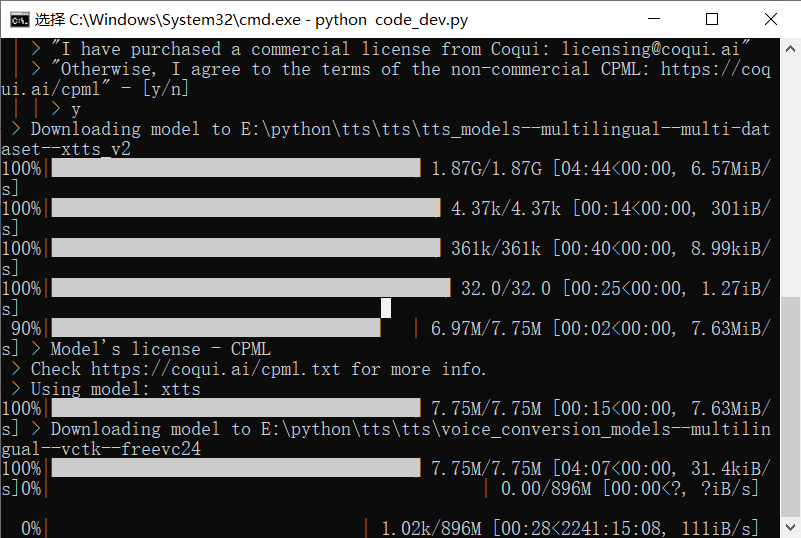

[简体中文](./README.md) / [Discord](https://discord.gg/TMCM2PfHzQ) / [Buy me a coffee](https://ko-fi.com/jianchang512) / [Twitter](https://twitter.com/mortimer_wang)

# CV Voice Clone Tool

> The model used in this project is xtts_v2 produced by [coqui.ai](https://coqui.ai/), and the model open source license is [Coqui Public Model License 1.0.0](https://coqui.ai/cpml.txt) , please follow this agreement when using this project. The full text of the agreement can be found at https://coqui.ai/cpml.txt


 
 This is a voice cloning tool that can use any human voice to synthesize a piece of text into a voice using that voice, or to convert one voice into another using that voice. 
 
 It's very easy to use, even without an N-series GPU. Download the precompiled version and double click on app.exe to open a web interface, and it can be used with a few mouse clicks. 
 
 Supports **Chinese English Japanese Korean eg. total 16 languages**, and can record voices online through a microphone. 
 
 To ensure the synthesized effect, it's recommended to record for 5 to 20 seconds, pronounce clearly and accurately, and don't have background noise. 
 
 


# Video Demonstration


https://github.com/jianchang512/clone-voice/assets/3378335/813d46dd-7634-43d1-97ae-1531369c471f


# How to use the precompiled version under win (other systems can deploy source code)


1. Download the 'precompiled version of the main file(1.7G) and Model(3G) separately from [Releases](https://github.com/jianchang512/clone-voice/releases) on the right. 
2. After downloading, unzip it to somewhere, for example E:/clone-voice. 
3. Double click app.exe, wait for the web window to open automatically, **Please read the text prompts in the CMD window carefully**, if there are errors, they will be displayed here.


4. After the model download, unzip it to the tts folder under the software directory, the effect after unzipping is as shown in the picture


5. Conversion operation steps:
	
	- Enter the text in the text box, or import the SRT file, or select "Voice-> Voice", choose the voice wav format file you want to convert.
	
	- Then select the voice you want to use from the drop-down box under "Voice wav file to use", if you are not satisfied, you can also click the "Upload locally" button, select a recorded 5-20s wav voice file. Or click the "Start recording" button to record your own voice for 5-20 seconds online, after recording, click to use.
	
	- Click the "Start Generating Now" button and wait patiently for completion.

6. If the machine has an N card GPU and CUDA environment is correctly configured, CUDA acceleration will be used automatically.


# Source Code Deployment (linux mac window) / Example: window

**If your area can't access google and huggingface, you'll need a global proxy because models need to be downloaded from github and huggingface**


0. Required python 3.9-> 3.11, and enable a global proxy, ensure the proxy is stable
1. Create an empty directory, such as E:/clone-voice, open a cmd window in this directory, the method is to type `cmd` in the address bar, then press Enter.
and exec git pull source code `git clone git@github.com:jianchang512/clone-voice.git . `
2. Create a virtual environment `python -m venv venv`
3. Activate the environment `E:/clone-voice/venv/scripts/activate`, linux and Mac exec `source ./venv/bin/activate`
4. Install dependencies: `pip install -r requirements.txt`
5. Unzip the ffmpeg.7z to the project root directory;for Linux and Mac, download the corresponding version of ffmpeg from the [ffmpeg official website](https://ffmpeg.org/download.html), unzip it to the root directory, and make sure to place the executable file ffmepg directly in the root directory.

    
   
6. **First run** `python code_dev.py`, enter `y` when prompted to accept the agreement, then wait for the model to be downloaded completely.
   


7. After downloading, restart `python app.py`.

8. Every startup will connect to the foreign Internet to check or update the model, please be patient and wait. If you don't want to check or update every time you start, you need to manually modify the files under the dependent package, open \venv\Lib\site-packages\TTS\utils\manage.py, around line 389, def download_model method, comment out the following code.

```
if md5sum is not None:
	md5sum_file = os.path.join(output_path, "hash.md5")
	if os.path.isfile(md5sum_file):
	    with open(md5sum_file, mode="r") as f:
		if not f.read() == md5sum:
		    print(f" > {model_name} has been updated, clearing model cache...")
		    self.create_dir_and_download_model(model_name, model_item, output_path)
		else:
		    print(f" > {model_name} is already downloaded.")
	else:
	    print(f" > {model_name} has been updated, clearing model cache...")
	    self.create_dir_and_download_model(model_name, model_item, output_path)
```

9. The startup of the source code version may frequently encounter errors, which are basically due to proxy problems that prevent the download of models from the walls or the download is interrupted and not complete. It is recommended to use a stable proxy and open it globally. If you can't download completely all the time, it's recommended to use the precompiled version.


# CUDA Acceleration Support

**Installation of CUDA tools**

If your computer has Nvidia graphics card, upgrade the graphics card driver to the latest, then go to install the corresponding [CUDA Toolkit 11.8](https://developer.nvidia.com/cuda-downloads) and [cudnn for CUDA11.X](https://developer.nvidia.com/rdp/cudnn-archive).
   
When installation is complete, press `Win + R`, type `cmd` then press Enter, in the pop-up window type `nvcc --version`, confirm the version information display, similar to this image
   
   
Then continue to type `nvidia-smi`, confirm there's output information, and you can see the cuda version number, similar to this image
   

That means the installation is correct, you can cuda accelerate now, otherwise you need to reinstall.


# Precautions

The model xtts can only be used for study and research, not for commerical use

0. The source code version requires global proxy, because it needs to download models from https://huggingface.co, and this website can't be accessed in China, the source code version may frequently encounter errors when starting, basically proxy problems lead to unable to download models from overseas or download interruption incomplete. It's recommended to use a stable proxy, open it globally. If you can't download completely all the time, it's recommended to use the precompiled version.

1. It will consume some time to load the model coldly after starting, please wait patiently for `http://127.0.0.1:9988` to be displayed, and automatically open the browser page, wait for two or three minutes before converting.

2. Functions include:

		Text to voice: that is, enter the text, generate voice with the selected voice.
		
		Voice to Voice: that is, select an audio file from the local area, generate another audio file with the selected voice.
		
3. If the cmd window opened for a long time doesn't move, you need to press Enter on it to continue output, please click on the icon in the upper left corner of cmd, select "Properties", then uncheck the "Quick Edit" and "Insert Mode" checkboxes


4. “The text length exceeds the character limit of 182/82 for language”

  This is because sentences separated by periods are too long. It is recommended to use periods to separate sentences that are too long, rather than excessive use of commas,


# [Youtube Demo Video](https://youtu.be/NL5cIoJ9Gjo)
